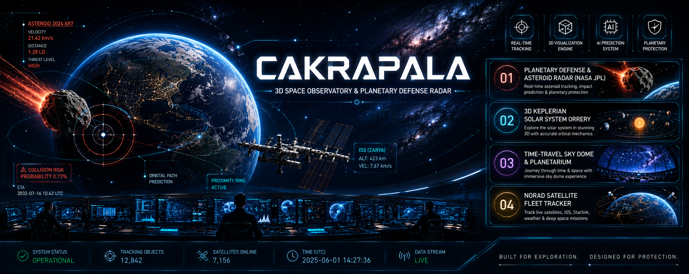

# 🌌 Cakrapala — 3D Aerospace Space Observatory & Planetary Defense Radar



> **An interactive, AI-augmented 3D space observatory and real-time planetary defense cockpit transforming raw NASA, NORAD, and IAU telemetry into intuitive spatial intelligence.**

---

## 🎯 1. Problem Statement

Despite billions of dollars invested in global space exploration and orbital infrastructure, scientific literacy and planetary defense face critical visualization and comprehension barriers:

1. **Space Disinformation & Sensationalism**: Mainstream media frequently publishes alarmist headlines regarding Near-Earth Asteroids (NEOs). The public lacks an accessible, verified radar to independently inspect true miss distances (in Lunar Distances), orbital trajectories, and Torino impact risk scales in real time.
2. **Abstract Astrophysics & STEM Education Barriers**: Fundamental orbital mechanics concepts—such as Keplerian elliptical orbits, hyperbolic gravity slingshots, orbital inclination penalties, and sidereal time—are difficult to grasp through 2D textbook diagrams and equations without interactive spatial 3D simulation.
3. **Mission Planning & Delta-V Accessibility**: Trajectory planning for satellite launches and lunar exploration traditionally requires expensive, proprietary enterprise desktop software (e.g., STK, GMAT), creating an immense barrier for students, researchers, and aerospace enthusiasts.

---

## 💡 2. Solution Description

**Cakrapala** is a browser-native, WebGL-powered 3D space observatory and mission control cockpit that delivers real-time astronomical intelligence through five integrated modules:

* **Real-Time Near-Earth Object (NEO) Radar**: Live tracking of asteroids ingested directly from NASA JPL NeoWs, displaying close-approach velocity, minimum miss distance, DEFCON threat status, and intuitive real-world physical size comparisons (e.g., Monas, Eiffel Tower, Boeing 747).
* **Multi-Satellite Fleet Orbit Tracker**: High-precision SGP4 propagation of active space assets (ISS, Tiangong CSS, Hubble Space Telescope, NOAA-19, Terra, Starlink) over CesiumJS 3D geospatial globes.
* **Topocentric IAU Ground Sky Dome**: Stellarium-style interactive sky view from any observer coordinate on Earth, rendering 9,000+ stars from the Yale Bright Star Catalog (BSC5) and 88 official IAU constellation vectors.
* **Heliocentric 3D Solar System Orrery**: Multi-body Keplerian planetary simulator modeling orbital periods, eccentricities, and semi-major axes across all 8 major solar system planets.
* **AI Mission Control Workspace (SYS-05)**: Physics-grounded decision-support cockpit for orbital satellite launches and Apollo-style Lunar Free-Return transfers with interactive 3D spatial flight paths and automated AI post-analysis.

---

## 🌌 3. Domain Focus & Mission Scope

* **Core Focus**: **AI for Science, Space Exploration & Open Data Innovation**
* **Strategic Pillars**:
  * **Open Scientific Data Utility**: Transforms complex, raw scientific APIs (NASA Open Data, NASA Horizons, CelesTrak NORAD, IAU) into high-impact public safety intelligence.
  * **Human-Centered STEM Visualization**: Replaces overwhelming raw data spreadsheets with intuitive 3D graphics, color-coded trajectory phases, and physical scale comparisons.
  * **Universal Web Accessibility**: Operates natively in any modern web browser via WebGL/WebAudio with zero installation barriers or hardware dependencies.

---

## 🤖 4. AI Approach & Technical Architecture

```
┌────────────────────────────────────────────────────────────────────────────────┐
│                        CAKRAPALA AI & SYSTEM ARCHITECTURE                      │
└────────────────────────────────────────────────────────────────────────────────┘
                                        │
    ┌───────────────────────────────────┼───────────────────────────────────┐
    ▼                                   ▼                                   ▼
┌───────────────────────┐   ┌───────────────────────┐   ┌───────────────────────┐
│   DATA INGESTION      │   │  ASTRODYNAMICS SOLVER │   │   AI REASONING LAYER  │
│  • NASA JPL NeoWs API │   │  • SGP4 Propagator    │   │  • IBM Granite Copilot│
│  • CelesTrak TLEs     │   │  • Tsiolkovsky Engine │   │  • Gemini AI Analysis │
│  • IAU Star Catalog   │   │  • Lambert Solver     │   │  • Voice Command HUD  │
└───────────┬───────────┘   └───────────┬───────────┘   └───────────┬───────────┘
            │                           │                           │
            └───────────────────────────┼───────────────────────────┘
                                        ▼
    ┌───────────────────────────────────────────────────────────────────┐
    │                 3D SPATIAL ENGINE (Three.js & CesiumJS)            │
    │  • 360° Full Daylight Earth (NASA 4K Blue Marble, Zero Shadow)    │
    │  • Exact Launch Site Pinning (Geodetic WGS-84 → ECI Coordinates)   │
    │  • Apollo Figure-8 Free-Return Hyperbolic Slingshot Splines       │
    │  • Interactive Flight Phase & Altitude Profile Visualizer         │
    └───────────────────────────────────────────────────────────────────┘
```

1. **Embedded AI Assistant (IBM Granite Space AI Co-Pilot)**:
   * Conversational natural language interface tuned for orbital mechanics, asteroid threat evaluation, and astronomical inquiries.
   * Hands-free tactical voice recognition and audio telemetry feedback.
2. **AI Mission Post-Analysis**:
   * Automated synthesis of mission feasibility, Delta-V margin risks, key flight events, and mission recommendations.
3. **Deterministic Pre-Flight Gatekeeper**:
   * All trajectory paths are verified by physics solvers before 3D rendering to ensure mathematical precision and zero numerical clipping.

---

## 🛠️ 5. How IBM Bob Was Used

**IBM Bob** served as the core enterprise AI software engineering and architecture copilot throughout the development lifecycle of Cakrapala:

1. **Software Architecture & Modular Decomposition**:
   * Guided the end-to-end Next.js 16 (App Router) + React 19 architecture, separating deterministic physics solvers (`lib/mission-control/`) from 3D WebGL rendering components (`components/mission-control/`).
2. **High-Precision Algorithmic Synthesis**:
   * Accelerated the mathematical implementation of complex coordinate transformations (Geodetic WGS-84 ⇄ ECEF ⇄ ECI ⇄ Three.js WebGL coordinates).
   * Formulated the Tsiolkovsky rocket equation, circular orbit velocity equations, Lambert universal-variable transfer solver, and Patched-Conic hyperbolic flyby geometry.
3. **Astrodynamic Figure-8 Trajectory Formulation**:
   * Engineered the seamless Apollo Figure-8 retrograde lunar loop, guaranteeing continuous 3D tube geometry without mesh clipping or visual breaks.
4. **Code Quality, Type Safety & Zero-Regression Verification**:
   * Enforced strict TypeScript interfaces across all data contracts.
   * Formulated automated Vitest unit test suites (`tests/mission-control/`) covering coordinate transforms, trajectory validation, AI analysis, and orbital planners (14/14 tests passing).

---

## 📊 6. Evaluation Points & Capability Matrix

| Evaluation Dimension | Technical Implementation & Architectural Evidence |
| :--- | :--- |
| **Technical Execution & Reliability** | • **Full-Stack Excellence**: Built on Next.js 16 (App Router), React 19, and strict TypeScript.<br>• **Multi-Engine 3D Graphics**: Three.js (Mission Control & Asteroids), CesiumJS (Satellite Fleets), and Babylon.js (Planetary Orrery).<br>• **Rigorous Closed-Form Astrodynamics**: Real-world Tsiolkovsky rocket equations, Vis-Viva orbital speed, Earth rotational boost (v_rot = ω_E · R_E · cos φ), Lambert transfer solver, and Patched-Conic Apollo Figure-8 flybys.<br>• **High Reliability**: 14/14 automated Vitest unit tests passing and 100% successful Next.js production builds. |
| **Innovation & Spatial Intelligence** | • **Spatial 3D Intelligence**: Replaces static Delta-V spreadsheets with an interactive 3D theater, featuring 360° full daylight Earth, exact Florida spaceport pinning, and non-clipping lunar retrograde loops.<br>• **Interactive Flight Phase Graphic**: Multi-color timeline profile bar and dynamic SVG altitude geometry sparklines.<br>• **Human-Scale Scale Comparisons**: Compares asteroid dimensions to tangible landmarks (Monas 132m, Eiffel Tower 330m, Boeing 747 70m).<br>• **Bidirectional Voice HUD**: Voice-command cockpit navigation. |
| **Domain Scope & Open Data Alignment** | • **100% Aligned with Open Science Data**: Directly ingests open scientific data from NASA JPL NeoWs, NASA Horizons, NORAD/CelesTrak TLEs, and the Yale Bright Star Catalog (BSC5).<br>• **Scientific Rigor**: Merges generative AI insights with deterministic physical constraints. |
| **Feasibility & Operational Deployment** | • **100% Browser-Native & Zero-Install**: Accessible globally without requiring $10,000+ desktop aerospace software licenses (STK/GMAT) or specialized GPU hardware.<br>• **Hallucination-Free Gatekeeper**: Physics engine calculates all Delta-V budgets and orbit geometries deterministically prior to rendering.<br>• **Optimized Performance**: Server-side API caching and disciplined WebGL memory management. |
| **Real-World Impact & Public Value** | • **Mitigating Media Panic & Disinformation**: Delivers a transparent, zero-bias visual radar for asteroid close-approaches to counter sensationalist media claims.<br>• **Democratizing Aerospace Education**: Empowers students, educators, and researchers worldwide to simulate orbital launches and lunar transfers interactively for free. |

---

## 🚀 Key Modules (System Cockpit)

| Module Code | Module Name | Core Technology | Primary Functionality |
| :--- | :--- | :--- | :--- |
| **SYS-01** | **3D Planetary Orrery** | Babylon.js & Keplerian Math | Heliocentric simulation of 8 primary solar system planets. |
| **SYS-02** | **IAU Sky Dome** | Astronomy-Engine & BSC5 Catalog | Topocentric Stellarium-style ground sky view with 9,000+ stars & IAU constellations. |
| **SYS-03** | **Asteroid Defense Radar** | NASA JPL NeoWs & Three.js | Real-time NEO proximity radar, DEFCON threat monitoring, and physical size scaling. |
| **SYS-04** | **Satellite Fleet Radar** | SGP4 Propagator & CesiumJS | Live multi-satellite tracking with ground tracks and sensor footprint cones. |
| **SYS-05** | **AI Mission Control** | Three.js & Astrodynamics Physics | Deterministic decision-support workspace for orbital satellite launch and Apollo-style Lunar Free-Return transfers with AI post-analysis. |

---

## 🛰️ Deep-Dive: AI Mission Control Engine (SYS-05)

### 1. The Core Innovation
**AI Mission Control** provides an intuitive, browser-native decision-support workspace:
1. **Interactive Mission Briefing**: Rapid configuration of launch sites (Cape Canaveral / Florida, Guiana, Tanegashima, Kourou, Mahia, etc.), vehicle classes, payload mass, target altitudes, and flight windows.
2. **Deterministic Physics Solver**: Real-time evaluation of launch vehicle capabilities, orbit insertions, and lunar flybys using verified astrodynamics equations.
3. **Photorealistic 3D Spatial Theater**:
   * **Full 360° Daytime Earth (NASA 4K Blue Marble)**: Eliminates dark shadows so all global launch sites, continents, and trajectory ground tracks remain crystal-clear from any camera angle.
   * **Exact Florida / Launch Site Pinning**: Precise geodetic-to-ECI coordinate alignment anchoring the liftoff point directly to the physical spaceport on Earth's surface.
   * **Apollo Figure-8 Lunar Free-Return Loop**: Continuous, gap-free retrograde hyperbolic trajectory that wraps gracefully around the far side of the Moon at perilune and returns directly to Earth's atmospheric entry interface (120 km).
4. **Interactive Flight Phase & Altitude Profile Graphic**:
   * **Multi-Color Flight Timeline Bar**: Visual phase breakdown mapping directly to 3D trajectory colors:
     * 🟠 **Outbound TLI Transfer (Orange)**: LEO departure burn on prograde transfer ellipse toward the Moon.
     * 🟣 **Lunar Perilune Flyby (Violet)**: Hyperbolic gravity slingshot swinging behind the Moon (200 km perilune).
     * 🔵 **Earth Free-Return Leg (Blue)**: Ballistic return path converging on Earth's atmospheric entry interface (120 km).
   * **Dynamic SVG Altitude Profile**: Real-time altitude geometry sparkline mapping the space vehicle's altitude curve from liftoff to lunar encounter and atmospheric reentry.
5. **Focused Decision Output & AI Post-Analysis**: Single-mode optimization (*Fastest Feasible / Shortest Time*) delivering an instantaneous feasibility verdict, Delta-V budget breakdown, flight timelines, and AI-driven mission risk assessment.

---

### 2. Astrodynamics & Mathematical Formulation

#### A. Rocket Performance & Delta-V Capacity (Tsiolkovsky Rocket Equation)
The vehicle's available velocity increment (Δv_avail) is calculated via the Tsiolkovsky equation:

```
Δv_avail = Isp · g₀ · ln( m_wet / (m_dry + m_payload) )
```

* **Isp**: Vacuum specific impulse of the propulsion system (seconds)
* **g₀**: Standard gravitational acceleration (9.80665 m/s²)
* **m_wet**: Initial vehicle wet mass (structural mass + propellant + payload)
* **m_dry + m_payload**: Final burnout mass after propellant expenditure

---

#### B. Satellite Launch Orbit Mechanics (LEO Insertion & Plane Change)

1. **Circular Orbital Velocity at Target Altitude (h)**:
   ```
   v_circ = √( μ_E / (R_E + h) )
   ```
   * **μ_E**: Earth gravitational parameter (398,600.44 km³/s²)
   * **R_E**: Earth mean equatorial radius (6,378.137 km)
   * **h**: Target orbital altitude above mean sea level

2. **Earth Rotation Boost from Launch Site Latitude (φ)**:
   ```
   v_rot = ω_E · (R_E + h_elev) · cos(φ)
   ```
   * **ω_E**: Earth angular rotation rate (7.2921159 × 10⁻⁵ rad/s)
   * **h_elev**: Launch site elevation above sea level

3. **Total Launch Delta-V Requirement**:
   ```
   Δv_req = v_circ - v_rot + Δv_grav + Δv_drag + Δv_steering + Δv_plane
   ```
   * **Atmospheric & Gravity Losses**: Modeled as `≈ 1,250 m/s · (h / 200)^0.05`
   * **Orbital Plane Change Penalty**:
     ```
     Δv_plane = 2 · v_circ · sin( |Δi| / 2 )   [if target inclination < launch latitude]
     ```

---

#### C. Lunar Free-Return Mechanics (Lambert Transfer & Patched-Conic Slingshot)

1. **Trans-Lunar Injection (TLI) from Parking Orbit (r₀ = R_E + h_park)**:
   ```
   v_TLI = √( 2·μ_E / r₀ - 2·μ_E / (r₀ + r_Moon) )
   Δv_TLI = v_TLI - √( μ_E / r₀ )
   ```
   * **r₀**: Earth circular parking orbit radius (6,578 km for 200 km LEO)
   * **r_Moon**: Distance to Moon at intercept epoch (~384,400 km)

2. **Hyperbolic Flyby & Retrograde Gravity Slingshot**:
   The spacecraft approaches the Moon's leading edge with hyperbolic excess velocity (v_inf). The Moon's gravitational parameter (μ_M = 4,904.87 km³/s²) bends the trajectory by turn angle (δ):

   ```
   sin( δ / 2 ) = 1 / ( 1 + (r_peri · v_inf² / μ_M) )
   ```
   * **r_peri**: Perilune radius from Moon center = R_Moon (1,737.4 km) + h_perilune (200 km)

3. **Continuous 3D Figure-8 Coordinate Synthesis**:
   In Moon-centered orbital coordinates defined by radial unit vector (u_rad) and tangential flight velocity unit vector (u_tan):

   ```
   r_flyby(θ) = r_Moon + r_M(θ) · [ cos(θ) · u_rad - sin(θ) · u_tan ],   θ ∈ [-π/2, +π/2]
   ```
   * Sweeps continuously behind the Moon's far side at perilune (θ = 0) without clipping through the lunar surface, directly routing the return vector toward Earth's atmospheric entry interface (h = 120 km).

---

#### D. Mission Feasibility & Margin Classification

```
Margin (Δv_margin) = Δv_avail - Δv_req
```

* **Feasible** (Δv_margin ≥ 500 m/s): Green indicator; nominal capability with safety reserves.
* **Marginal** (0 ≤ Δv_margin < 500 m/s): Amber indicator; flight possible under nominal conditions, sensitive to trajectory dispersion.
* **Infeasible** (Δv_margin < 0 m/s): Red indicator; vehicle propellant capacity is insufficient for the requested payload and orbit.

---

## 🛠️ Tech Stack

* **AI & Engineering Platform**: **IBM Bob** (Development & Architecture Copilot) + **IBM Granite / Gemini** (Astrophysical AI Co-Pilot & Mission Post-Analysis)
* **Framework**: [Next.js 16 (App Router)](https://nextjs.org/) + [React 19](https://react.dev/) + [TypeScript](https://www.typescriptlang.org/)
* **3D & Geospatial Engines**: [Three.js](https://threejs.org/) + [CesiumJS](https://cesium.com/) + [Babylon.js](https://www.babylonjs.com/)
* **Astrophysics Math**: `astronomy-engine`, `satellite.js` (SGP4), Lambert Universal-Variable Solver, Patched-Conic Mechanics, WGS-84 Ellipsoid Transforms
* **Styling & UI**: Tailwind CSS + Lucide Icons + Frosted Sci-Fi Glassmorphism
* **Data Sources**: NASA JPL NeoWs, NASA Horizons, CelesTrak NORAD, Yale Bright Star Catalog (BSC5)

---

## 💻 Getting Started

### Prerequisites
* Node.js 18+ or 20+
* npm, pnpm, or yarn

### Installation
```bash
# Clone repository
git clone https://github.com/your-username/cakrapala.git

# Install dependencies
npm install

# Run automated tests
npm test

# Run development server
npm run dev
```

Open [http://localhost:3000](http://localhost:3000) with your browser. Navigate to [http://localhost:3000/mission-control](http://localhost:3000/mission-control) to access **AI Mission Control**.

---

## 📜 License
This project is open-source under the MIT License.
