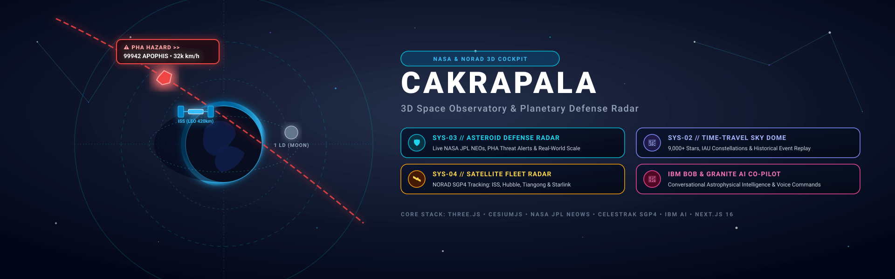

# 🌌 Cakrapala — 3D Aerospace Space Observatory & Planetary Defense Radar



> **An interactive, AI-augmented 3D space observatory and real-time planetary defense cockpit transforming raw NASA, NORAD, and IAU telemetry into intuitive spatial intelligence.**

---

### 1. Problem Solved
Despite billions of dollars invested in space exploration, global astronomical literacy faces a profound **information visualization gap**:

1. **Space Disinformation & Misinformation Mitigation**: Eliminates sensationalist media panic by providing citizens, students, and researchers with a transparent, zero-bias radar to inspect verified NASA asteroid trajectories, flyby miss distances, and Torino impact risk scales in real time.
2. **STEM & Astrophysics Education Accessibility**: Translates abstract mathematical concepts—such as Keplerian elliptical orbits, hyperbolic gravitational flybys, orbital inclination, and sidereal time—into interactive 3D WebGL simulations without requiring expensive software licenses or high-end GPU workstations.
3. **Topocentric Observation from Earth**: Delivers precise observer-centric vector coordinates (Azimuth & Altitude) and Greenwich Mean Sidereal Time (GMST) calibrated for local observers worldwide using geodetic WGS-84 ellipsoid transformations.

---

### 2. AI & Technical Approach (Powered by IBM Bob & IBM Granite)

```mermaid
graph TD
    subgraph Data & Telemetry Ingestion
        NASA[NASA JPL NeoWs API] --> API[/api/asteroids]
        NORAD[NORAD CelesTrak TLE] --> SGP4[satellite.js SGP4 Engine]
        IAU[Yale BSC5 9,000+ Stars] --> SkyEngine[astronomy-engine]
    end

    subgraph AI Intelligence Layer (IBM Bob & IBM Granite)
        IBMBob[IBM Bob AI Developer & Architecture Copilot] -.-> Architecture[System Architecture & Code Synthesis]
        Granite[IBM Granite Space AI Co-Pilot] --> NLP[Astrophysical Reasoning & NLP]
        NLP --> Voice[Bidirectional Web Speech Synthesis]
    end

    subgraph 3D Spatial Rendering & HUD Cockpit
        API --> Radar[Three.js Asteroid Proximity Radar]
        SGP4 --> SatGlobe[CesiumJS Geospatial Satellite Fleet]
        SkyEngine --> SkyDome[Stellarium-Style Ground Sky View]
        Voice --> HUD[Aerospace Tactical Telemetry Deck]
    end
```

* **Role of IBM Bob (AI Engineering & Architecture Copilot)**:
  * **Architectural Acceleration**: **IBM Bob** served as the core enterprise AI copilot guiding the end-to-end software architecture, modular decomposition, and Keplerian mathematical formulation.
  * **High-Precision Algorithmic Synthesis**: Accelerated the development of complex coordinate transformation matrices (ECEF $\leftrightarrow$ ENU $\leftrightarrow$ Topocentric Az/Alt), SGP4 orbital propagation, and hyperbolic trajectory curves.
  * **Code Quality & Type Safety**: Ensured strict TypeScript type definitions, zero-regression builds, and optimized server-side caching routines for NASA JPL API endpoints.

* **Embedded AI Assistant (IBM Granite Space AI Co-Pilot)**:
  * **Domain-Tuned Astrophysical Reasoning**: An embedded conversational AI co-pilot capable of answering complex inquiries regarding orbital mechanics, asteroid classification (Apollo, Amor, Aten), satellite orbital decay, and deep-space missions.
  * **Voice Command Interface**: Bidirectional speech recognition and tactical voice synthesis for hands-free mission control navigation.

* **NASA JPL NeoWs Real-Time Telemetry Engine**:
  * Automated ingestion of Near-Earth Objects (NEOs) with server-side caching (`app/api/asteroids/route.ts`).
  * Mathematical conversion of Lunar Distances ($1\text{ LD} \approx 384,400\text{ km}$), relative approach velocities, and orbital elements ($a, e, i, \Omega, \omega$).
  * Kinetic impact energy evaluation ($E = \frac{1}{2}mv^2$ in Megatons of TNT equivalent).

* **Photorealistic 3D Spatial Graphics (Three.js & CesiumJS)**:
  * Textured Earth model with true $23.44^\circ$ axial tilt and Rayleigh atmospheric scattering glow.
  * Deep-space asymptotic hyperbolic trajectory ribbons spanning interplanetary distances ($280+$ 3D units).
  * High-resolution camera-facing billboard tactical approaching chevrons ($\gg$).

* **NORAD SGP4 Multi-Satellite Fleet Tracking**:
  * Real-time SGP4 orbit calculation for ISS, Tiangong CSS, Hubble Space Telescope, NOAA-19, Terra, and Starlink.

---

### 3. Relevance to Challenge Theme

* **Transforming Open Data into High-Impact Public Utility**: Bridges the gap between complex open government APIs (NASA Open Data, CelesTrak) and civilian public safety by delivering a reliable planetary defense monitoring system.
* **Human-Centered Design Thinking**: Engineered through systematic user discovery (*Empathize $\rightarrow$ Persona $\rightarrow$ Define $\rightarrow$ Ideate $\rightarrow$ Prototype*), replacing overwhelming data spreadsheets with intuitive physical size comparisons (*e.g., Monas 132m, Eiffel Tower 330m, Boeing 747 70m*).
* **Enterprise-Grade AI Integration**: Demonstrates the real-world power of **IBM Bob** and **IBM Granite** in accelerating scientific software engineering, complex mathematical modeling, and conversational user interfaces.
* **Universal Web Accessibility**: Operates natively in any modern web browser via WebGL with zero installation barriers.

---

## 🚀 Key Modules (System Cockpit)

| Module Code | Module Name | Core Technology | Primary Functionality |
| :--- | :--- | :--- | :--- |
| **SYS-01** | **3D Planetary Orrery** | Babylon.js & Keplerian Math | Heliocentric simulation of 8 primary solar system planets. |
| **SYS-02** | **IAU Sky Dome** | Astronomy-Engine & BSC5 Catalog | Topocentric Stellarium-style ground sky view with 9,000+ stars & IAU constellations. |
| **SYS-03** | **Asteroid Defense Radar** | NASA JPL NeoWs & Three.js | Real-time NEO proximity radar, DEFCON threat monitoring, and physical size scaling. |
| **SYS-04** | **Satellite Fleet Radar** | SGP4 Propagator & CesiumJS | Live multi-satellite tracking with ground tracks and sensor footprint cones. |

---

## 🛠️ Tech Stack

* **AI & Engineering Platform**: **IBM Bob** (Development & Architecture Copilot) + **IBM Granite** (Astrophysical AI Co-Pilot)
* **Framework**: [Next.js 16 (App Router)](https://nextjs.org/) + [React 19](https://react.dev/) + [TypeScript](https://www.typescriptlang.org/)
* **3D & Geospatial Engines**: [Three.js](https://threejs.org/) + [CesiumJS](https://cesium.com/) + [Babylon.js](https://www.babylonjs.com/)
* **Astrophysics Math**: `astronomy-engine`, `satellite.js` (SGP4), WGS-84 Ellipsoid Transforms
* **Styling & UI**: Tailwind CSS + Lucide Icons + Frosted Sci-Fi Glassmorphism
* **Data Sources**: NASA JPL NeoWs, NASA Horizons, CelesTrak NORAD, Yale Bright Star Catalog (BSC5)

---

## 💻 Getting Started

### Prerequisites
* Node.js 18+ or 20+
* npm, pnpm, or yarn

### Installation
```bash
# Clone repository
git clone https://github.com/your-username/cakrapala.git

# Install dependencies
npm install

# Run development server
npm run dev
```

Open [http://localhost:3000](http://localhost:3000) with your browser.

---

## 📜 License
This project is open-source under the MIT License.
